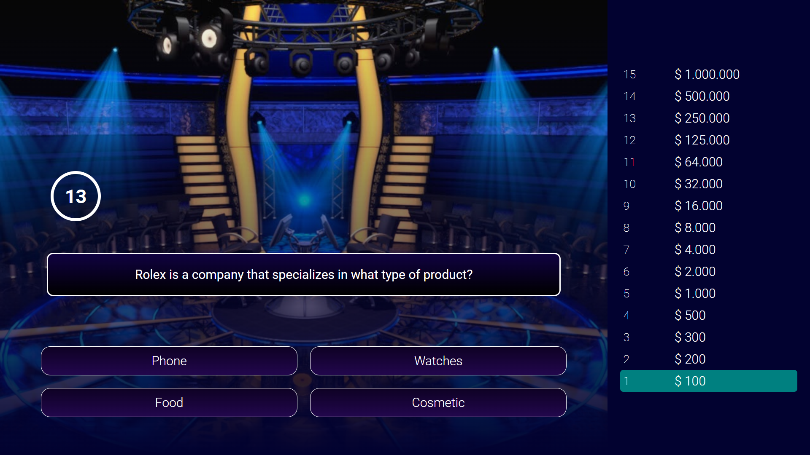

# 📝 Millionaire Quiz App

## Overview

This is a Quiz Application built using React. The app allows users to take quizzes on various topics, track their earnings, and improve their knowledge in a fun and interactive way.

## 🔗 Project URL

Check out the live version of the project here: [Quiz-App](https://millionaire-quiz-challenge.netlify.app/)

## 🖼️ Screenshots

## 🛠️ Technologies Used

- **React:** A JavaScript library for building user interfaces.

## ✨ Features

- **Responsive Design:** Works seamlessly on both desktop and mobile devices.
- **Interactive UI:** A user-friendly interface that provides immediate feedback on answers.
- **Earnings Tracking:** Keep track of your earnings to monitor your progress.

## 🚀 Getting Started

To run this project locally, follow these steps:

1. Clone the repository: `git clone https://github.com/Developer-Bilal/react-quiz-app.git`
2. Navigate to the project directory: `cd react-quiz-app`
3. npm install
4. npm start

The application should now be running on http://localhost:3000.

## 📧 Contact

If you have any questions or suggestions, feel free to reach out:

- Email: bilalchanna67@gmail.com ✉️
- LinkedIn: [Profile](https://www.linkedin.com/in/Engineer-Bilal-Channa) 💼
